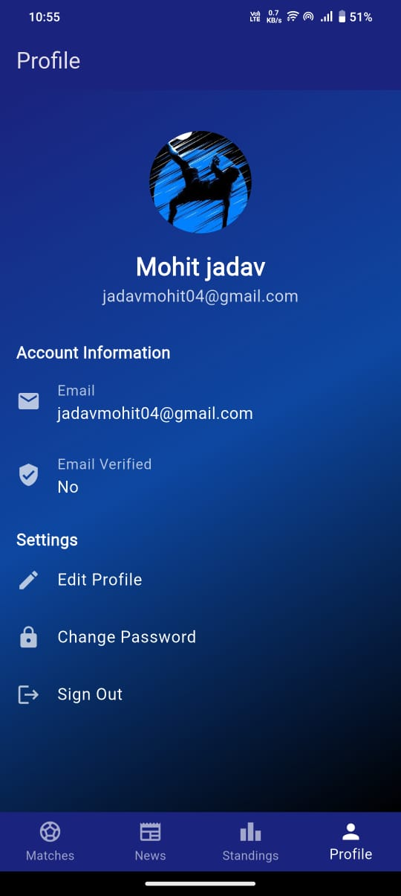

# ⚽ Football Score

<div align="center">
  
  <p>A comprehensive football companion app that brings you real-time scores, and live updates from the world's top leagues. Built with Flutter, view league standings, and stay updated with the latest football news. Football Score keeps you connected to the beautiful game.</p>

  
  
  
  
</div>

## ✨ Features

- 🎯 *Live Scores* - Real-time football match updates
- 📊 *League Standings* - Live tables for major leagues
- 📰 *News Feed* - Latest football news and updates
- 🔐 *User Accounts* - Secure authentication with Firebase
- 🌍 *Major Leagues* - Coverage of Premier League, La Liga, Serie A, Bundesliga, and Ligue 1
- 👤 *Profile Management* - Customizable user profiles with image upload
- 🌙 *Modern UI* - Clean and intuitive interface

## 📱 Screenshots

<table>
  <tr>
    <td>Live Matches</td>
    <td>League Tables</td>
    <td>News Feed</td>
    <td>Profile</td>
  </tr>
  <tr>
    <td></td>
    <td></td>
    <td></td>
    <td></td>
  </tr>
</table>

## 🚀 Getting Started

### Prerequisites

- Flutter (3.0 or higher)
- Firebase account
- VS Code / Android Studio

### Installation

1. Clone the repository
```bash
git clone https://github.com/yourusername/Football_Score.git
```

2. Install dependencies
```bash
flutter pub get
```

3. Configure Firebase
   - Create a new Firebase project
   - Add your `google-services.json` to `android/app`
   - Enable Authentication in Firebase Console
   - Configure Google Sign-in

4. Run the app
```bash
flutter run
```

## 🏗 Project Structure

```
lib/
├── config/         # App configuration & themes
├── models/         # Data models
├── providers/      # State management
├── screens/        # UI screens
├── services/       # API & Firebase services
└── widgets/        # Reusable components
```

## 🛠 Built With

- [Flutter](https://flutter.dev/) - UI framework
- [Firebase](https://firebase.google.com/) - Authentication & Storage
- [Provider](https://pub.dev/packages/provider) - State management
- [Football API](https://your-api-provider.com) - Football data services

## 📄 License

This project is licensed under the MIT License - see the [LICENSE](LICENSE) file for details

## 👥 Authors

- **Mohit Jadav** - [GitHub](https://github.com/mohitjadav)

## 👥 Contact

For any queries or suggestions, please reach out at jadavmohit92@gmail.com

## 🙏 Acknowledgments

- Thanks to all contributors
- Football data provided by [API Provider Name]
